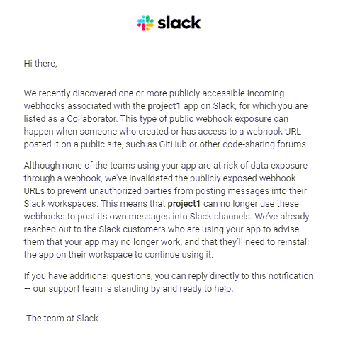
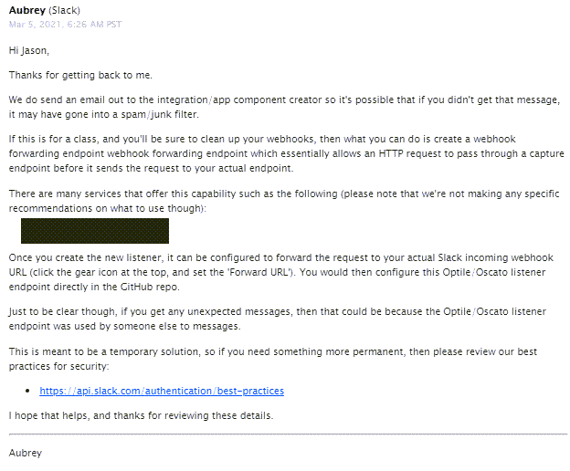
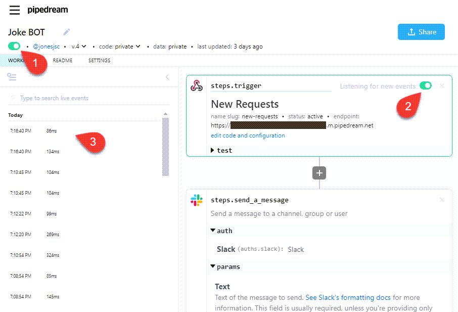

# Slack Integration
This application posts jokes to a private slack channel for the Project 1 Team 4 group.

An interesting issue was discovered during the testing of this integration:

The method we are using to post messages to slack is via a simple webhook URL.  This approach is insecure, as anyone armed with the webhook URL can post messages into our Slack channel.

Slack has a policy of invalidaing any webhooks that they discover "in the wild" / "in the clear".   Pushing our project code to a public repo at github was detected by Slack's automated security system, and the slack webhook was unvalidated (deleted.)

### Invalidated webhook email notification from Slack

We opened a technical support case with SLACK, and they suggested that since this was a small testing acedemic exercise that we might consdier deploying through a URL forwarded:

After exploring a couple of options, including the one suggested by Slack technical support, we've elected for this exercise to use the WORKFLOW feature at pipedream.com

pipedream masks the Slack webhook from public view, preventing Slack's automated security system from invalidating the webhook.  Pipedream also offers us mulitple ways to temporary disable the slack posting (1) (2), and also offers a logging capability to help with troubleshooting.  The free account will executie 100,000 monthly invocations.

So - our applicaiton calls the pipedream webhook, which in turn passes the call through to Slack.